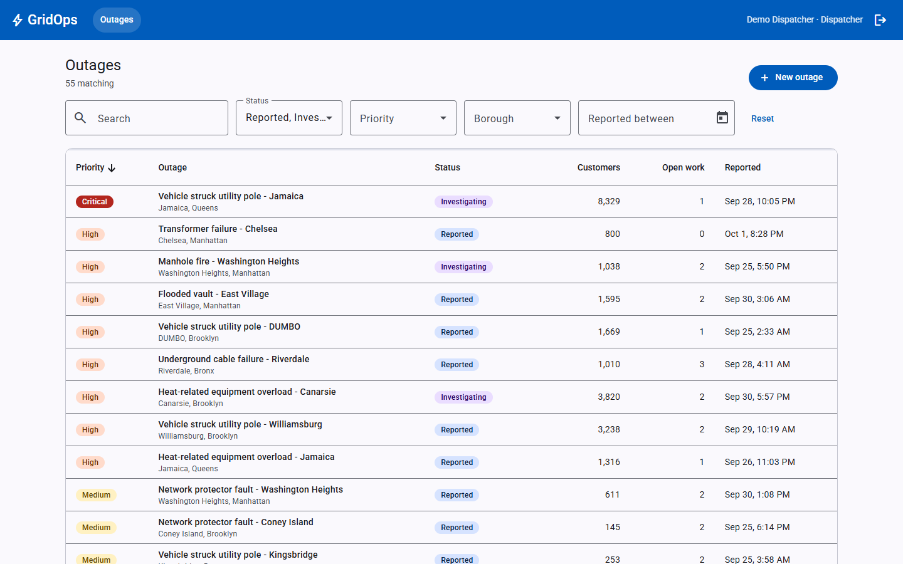
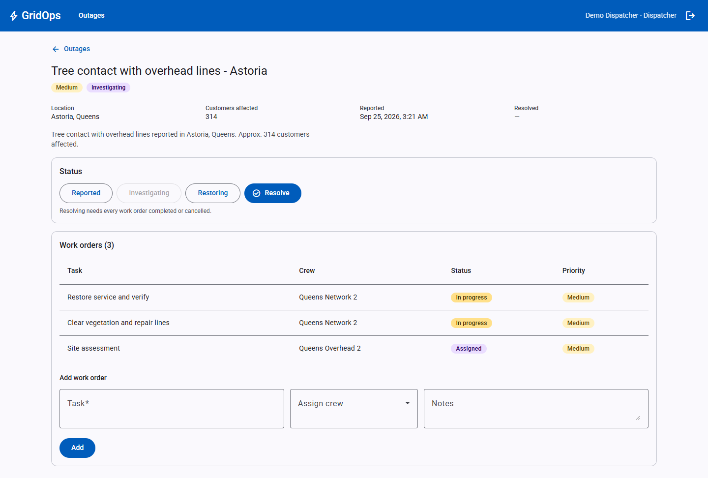
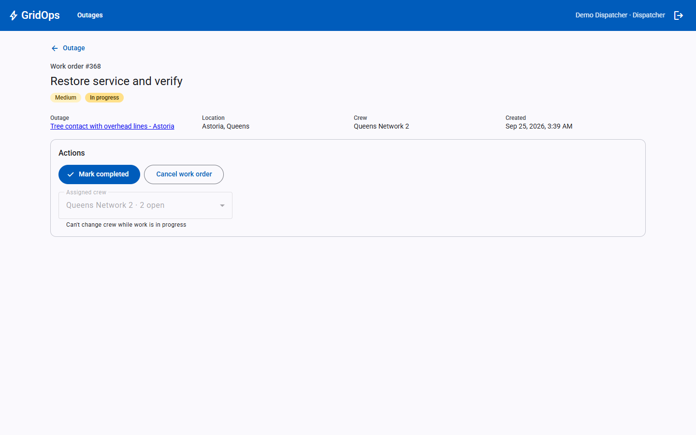
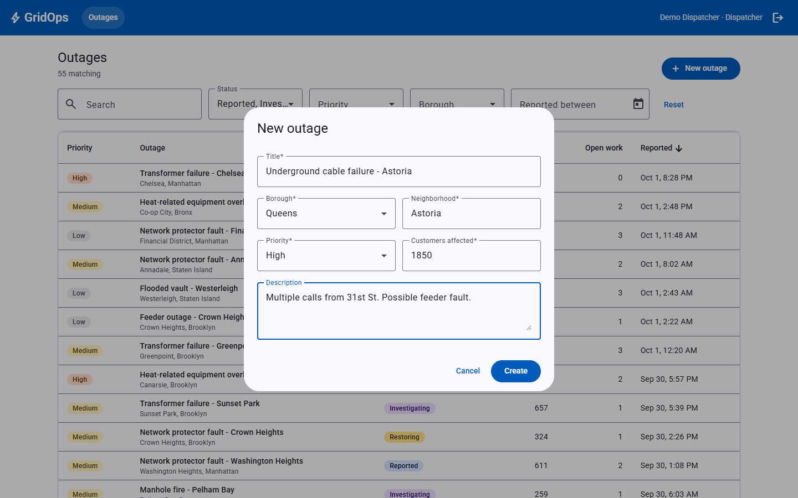
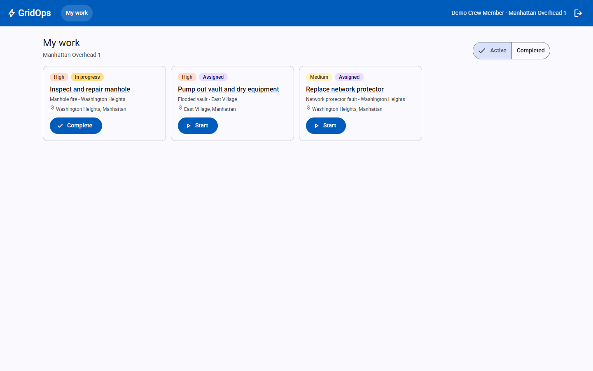
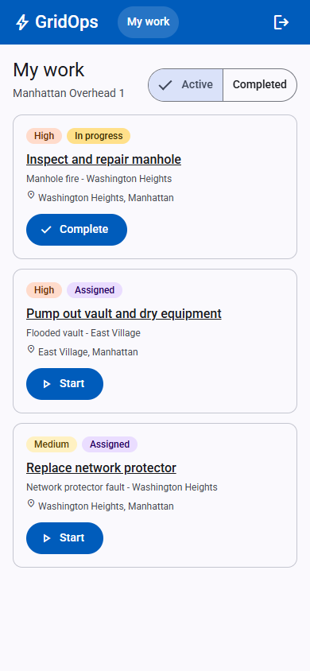
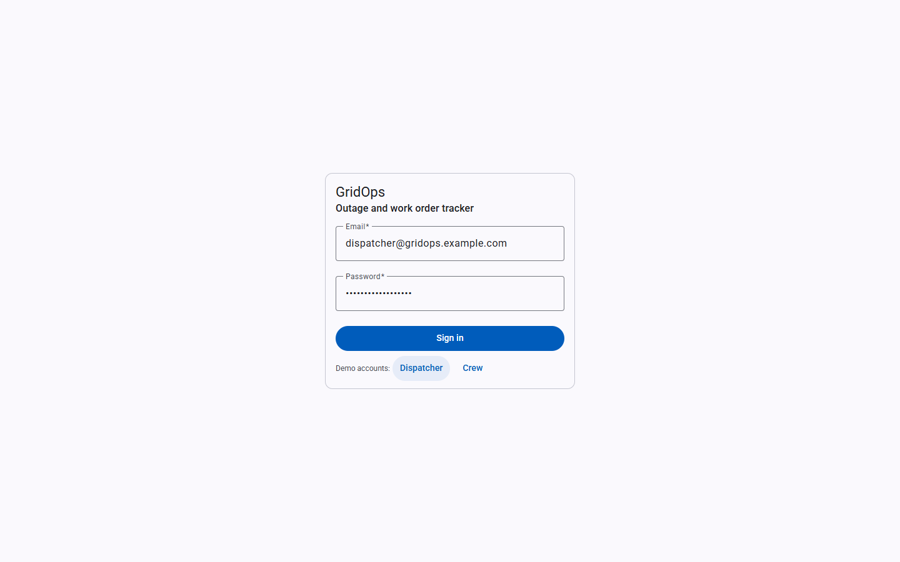

# GridOps

[](https://github.com/Juveria22/gridops/actions/workflows/ci-cd.yml)

Outage and work order tracker for an electric utility. Dispatchers log outages and assign work orders to field crews; crews see and update their own work.



## Highlights

- **~10x faster dashboard query** (17.9 ms -> 1.7 ms, 98% fewer pages read) on 200k outages with composite SQL Server indexes, verified against execution plans ([benchmark](benchmarks/README.md))
- **JWT auth with two layers of authorization**: role-based (Dispatcher / Crew) plus per-row ownership, so crews only ever see their own crew's work
- **53 xUnit tests against real SQL Server** (Testcontainers), including full-pipeline HTTP tests. Key tests checked to fail when the code they guard is removed
- **Angular 22** with signals, lazy-loaded routes (89 kB initial load) and an RxJS `debounceTime` / `switchMap` filter pipeline: typing a search sends 1 request, not 8
- **CI/CD on every push**: tests, production build, deployable package with an EF migrations bundle, gated Azure deploy using OIDC

## Screenshots

| Outage detail | Work order |
|---|---|
|  |  |

| New outage | Crew view | Crew on a phone |
|---|---|---|
|  |  |  |

Login has one-click demo accounts for both roles: 

## Stack

- **API:** ASP.NET Core Web API (.NET 10 LTS), Entity Framework Core 10, SQL Server
- **Client:** Angular 22 (standalone components, signals), Angular Material, RxJS
- **Tests:** xUnit, Testcontainers, Respawn, `WebApplicationFactory`
- **CI/CD:** GitHub Actions. Azure App Service + Azure SQL ready ([deploy guide](deploy/README.md))
- **Local infra:** SQL Server 2022 in Docker

## Repo layout

```
/api            ASP.NET Core Web API
/api.tests      xUnit tests
/client         Angular app
docker-compose.yml   Local SQL Server
```

## Local setup

Prerequisites: .NET 10 SDK, Node 22+, Docker Desktop (WSL 2 backend on Windows).

1. **Start SQL Server**

   ```bash
   cp .env.example .env        # then edit MSSQL_SA_PASSWORD
   docker compose up -d
   ```

2. **Set secrets** (kept out of source control, stored under your user profile): the connection string and a JWT signing key (32+ bytes).

   ```bash
   dotnet user-secrets set "ConnectionStrings:GridOps" \
     "Server=localhost,1433;Database=GridOps;User Id=sa;Password=<your password>;TrustServerCertificate=True;Encrypt=True" \
     --project api
   dotnet user-secrets set "Jwt:SigningKey" "$(openssl rand -base64 48)" --project api
   ```

   The API refuses to start if either is missing.

3. **Create the database and seed dev data**

   ```bash
   dotnet tool restore                          # installs dotnet-ef (pinned in dotnet-tools.json)
   dotnet ef database update --project api      # applies migrations, creates GridOps db
   dotnet run --project api -- seed             # ~500 outages across NYC boroughs (Development only)
   ```

   Seed is skipped if outages already exist. `--outages N` for a different size.

4. **Run the API**

   ```bash
   dotnet run --project api --launch-profile http
   ```

   - Swagger UI: http://localhost:5257/swagger
   - OpenAPI document: http://localhost:5257/openapi/v1.json
   - Health (includes a database check): http://localhost:5257/health

5. **Run the client** (Node 22.22+ or 24)

   ```bash
   cd client
   npm install
   npm start          # http://localhost:4200, /api proxied to :5257
   ```

   Sign in with a demo account (buttons on the login page).

## Client

Angular 22 standalone components, Angular Material, signals for state, RxJS for streams.

| Route | Role | |
|---|---|---|
| `/login` | anyone | demo account shortcuts |
| `/dashboard` | Dispatcher | outage table: search, status/priority/borough/date filters, sort, paging, new outage dialog |
| `/outages/:id` | Dispatcher | details, status changes, work orders, add + assign |
| `/work-orders/:id` | both | crew: start/complete. dispatcher: also reassign/cancel |
| `/my-work` | Crew | own crew's active + completed work, quick start/complete |

- `authInterceptor` adds the bearer token to API calls only. 401 -> logout + "session expired"
- `authGuard` / `roleGuard` redirect by login and role. UX only, the API enforces access
- dashboard filters: `debounceTime(300)` -> `distinctUntilChanged` -> `switchMap` (cancels stale requests). typing "Brooklyn" sends 1 request, not 8
- pages are lazy loaded (`loadComponent`)
- token kept in localStorage so refresh keeps you signed in (trade-off: XSS-readable; httpOnly cookie is the stricter option)

## Data model

- **Outage**: borough, neighborhood, customers affected, status, priority, reported/resolved times. Has many work orders.
- **WorkOrder**: belongs to one outage, optionally assigned to one crew.
- **Crew**: field team with a home borough. Has members (users) and work orders.
- **User**: dispatcher or crew member. Auth added in phase 4.

Enums are stored as strings. All timestamps are UTC `datetimeoffset`.

## Auth

JWT bearer tokens. Log in, then send `Authorization: Bearer <token>`. Tokens last 2 hours. In Swagger UI use **Authorize**.

```bash
curl -X POST http://localhost:5257/api/auth/login -H "Content-Type: application/json"   -d '{"email":"dispatcher@gridops.example.com","password":"GridOps-Demo-2026!"}'
```

Seeded demo accounts (Development only, all seeded users share this password):

| Email | Role |
|---|---|
| `dispatcher@gridops.example.com` | Dispatcher |
| `crew@gridops.example.com` | Crew (Manhattan Overhead 1) |

| | Dispatcher | Crew |
|---|---|---|
| Outages (list, view, create, status) | yes | no (403) |
| Crews list | yes | no (403) |
| Create work order, assign crew | yes | no (403) |
| List / view work orders | all | own crew only. others return 404 |
| Update work order status | any | own crew, InProgress/Completed only |

- every endpoint requires a token unless marked `[AllowAnonymous]` (login, `/health`, OpenAPI doc)
- passwords hashed with ASP.NET Core `PasswordHasher` (PBKDF2, per-user salt)
- login rate limited to 5 attempts/min per IP (429 + `Retry-After`)
- same 401 for unknown email and wrong password

## API

| Method | Route | Notes |
|---|---|---|
| POST | `/api/auth/login` | anonymous. returns `{ accessToken, expiresAt, user }` |
| GET | `/api/auth/me` | current user |
| GET | `/api/outages` | filters: `status`, `priority`, `borough` (repeatable), `from`, `to`. `sortBy` = reportedAt / priority / customersAffected, `sortDir`, `page`, `pageSize` (max 100) |
| GET | `/api/outages/{id}` | includes work orders |
| POST | `/api/outages` | 201 + Location |
| PATCH | `/api/outages/{id}/status` | 409 if already resolved or work orders still open |
| GET | `/api/work-orders` | filters: `status`, `crewId`, `outageId` + paging |
| GET | `/api/work-orders/{id}` | |
| POST | `/api/outages/{id}/work-orders` | 409 if outage resolved |
| PUT | `/api/work-orders/{id}/crew` | `{ "crewId": 5 }` or `null` to unassign |
| PATCH | `/api/work-orders/{id}/status` | InProgress/Completed need a crew. Completed/Cancelled are final |
| GET | `/api/crews` | `borough`, `includeInactive`. includes open work count |

Example: `GET /api/outages?status=Reported&status=Restoring&borough=Brooklyn&sortBy=priority&page=1`

Paged responses: `{ items, page, pageSize, totalCount, totalPages }`

### Errors

All errors are [ProblemDetails](https://www.rfc-editor.org/rfc/rfc9457) with a `traceId` that matches the server logs.

| Status | When |
|---|---|
| 400 | validation failed. `errors` has camelCase field names |
| 401 | missing/invalid/expired token, or bad login |
| 403 | logged in but wrong role |
| 404 | resource not found |
| 409 | valid request but breaks a business rule (e.g. resolving with open work orders) |
| 429 | too many login attempts |
| 500 | unexpected. no internals outside Development |

```json
{ "status": 400, "title": "One or more validation errors occurred.",
  "errors": { "pageSize": ["The field PageSize must be between 1 and 100."] }, "traceId": "00-..." }
```

## Tests

```bash
dotnet test        # needs Docker running
```

53 xUnit tests against a real SQL Server 2022 in a throwaway container ([Testcontainers](https://dotnet.testcontainers.org/)) with the real EF migrations. ~45s including container startup.

| | |
|---|---|
| `Services/OutageServiceTests` | resolve rules, filters, date range, priority severity sort, stable paging |
| `Services/WorkOrderServiceTests` | crew ownership, crew-without-crew sees nothing, status rules, crew assignment |
| `Services/AuthServiceTests` | login, token claims, same error for bad email/password, per-user salt |
| `Api/ApiEndpointTests` | full HTTP pipeline via `WebApplicationFactory`: 401/403/404/409/400/429, tampered token, query binding, enum JSON |

- not EF InMemory / SQLite: they don't run real SQL (string-enum priority ranking, `DateTimeOffset` ordering, constraints)
- [Respawn](https://github.com/jbogard/Respawn) wipes data before each test, so order doesn't matter
- `FakeTimeProvider` + `FakeCurrentUser` replace the clock and the JWT user in service tests
- key tests were checked to fail when the code they guard is removed (e.g. the paging tie-breaker, the null-crew guard)


Composite indexes on the dashboard filters cut the main dashboard query from 17.9 ms to 1.7 ms and pages read by 98% on 200k outages. Method and numbers in [benchmarks/README.md](benchmarks/README.md).
